# aws-lambda-python-collection
AWS Lambdaで動作するPythonコード集

<br>

# Tree
本リポジトリは以下のファイル構成である。

```bash
aws-lambda-python-collection
├── README.md
├── check-requests-from-lambda # LambdaからHTTPまたはHTTPSリクエストをする
│   ├── LambdaLayer.zip # LambdaLayer用zip
│   ├── check-requests-from-lambda.py
│   └── create_lambda_layer_for_python_requests.sh # LambdaLayer.zip作成スクリプト
├── check-socket-from-lambda # Lambdaからの疎通を確認する
│   └── check-socket-from-lambda.py
├── crud-from-apigateway-to-dynamodb-by-http # API Gateway(HTTP API)からDynamoDBへCRUDする
│   ├── API利用方法(HTTP).md
│   └── crud-from-apigateway-to-dynamodb-by-http.py
├── crud-from-apigateway-to-dynamodb-by-rest # API Gateway(REST API)からDynamoDBへCRUDする
│   └── crud-from-apigateway-to-dynamodb-by-rest.py
├── images # README.md用イメージ
│   ├── check-requests-from-lambda_environment.png
│   ├── check-socket-from-lambda_environment.png
│   ├── crud-from-apigateway-to-dynamodb-by-http_architecture-diagrams.png
│   ├── crud-from-apigateway-to-dynamodb-by-http_environment.png
│   ├── crud-from-apigateway-to-dynamodb-by-http_integration-target.png
│   ├── crud-from-apigateway-to-dynamodb-by-http_route-and-method.png
│   ├── crud-from-apigateway-to-dynamodb-by-rest_environment_environment.png
│   ├── crud-from-apigateway-to-dynamodb-by-rest_architecture-diagrams.png
│   ├── crud-from-apigateway-to-dynamodb-by-rest_integration-request.png
│   ├── crud-from-apigateway-to-dynamodb-by-rest_resource-and-method.png
│   ├── ses-send-email-with-s3-attachment_environment.png
│   ├── sync-files-from-s3-to-ec2-on-linux_lambda_environment.png
│   ├── sync-files-from-s3-to-ec2-on-linux_s3_event_1.png
│   ├── sync-files-from-s3-to-ec2-on-linux_s3_event_2.png
│   ├── sync-files-from-s3-to-ec2-on-windows_lambda_environment.png
│   ├── sync-files-from-s3-to-ec2-on-windows_s3_event_1.png
│   └── sync-files-from-s3-to-ec2-on-windows_s3_event_2.png
├── ses-send-email-with-s3-attachment # SESでS3に配置されたファイルを添付送信する
│   └── ses-send-email-with-s3-attachment.py
├── sync-files-from-s3-to-ec2-on-linux # S3に配置されたファイルをEC2(Linux)に同期する
│   └── sync-files-from-s3-to-ec2-on-linux.py
└── sync-files-from-s3-to-ec2-on-windows # S3に配置されたファイルをEC2(Windows)に同期する
    └── sync-files-from-s3-to-ec2-on-windows.py
```

<br>

# Requirement
- AWS Lambdaでの動作を前提とする。
- Lambdaには、動作に必要な権限が付与されたIAMロールがアタッチされている事。
- PythonでSSMを実行する場合は、実行先EC2に動作に必要な権限が付与されたIAMロール(InstanceProfile)がアタッチされている事。<br>
また、実行先EC2では`SSM Agent`が実行中である事。
    > **Note**<br>
    > 実行先EC2がWindowsServerである場合はFirewallでブロックされていない事。

<br>

# Usage
## check-requests-from-lambda
- `create_lambda_layer_for_python_requests.sh`を実行する。<br>
このスクリプトは`LambdaLayer.zip`を生成する。<br>
RockyLinux9.1環境で動作確認済
- AWS Lambdaのレイヤーを作成する。<br>
生成した`LambdaLayer.zip`をアップロードする。
- Lambda関数を作成する。
- 環境変数に以下の項目を設定する。

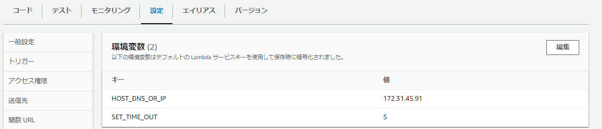

```conf
HOST_DNS_OR_IP = ${HostのDNSまたはIP}
SET_TIME_OUT = ${タイムアウトするまでの秒数}
```

<br>

## check-socket-from-lambda
- Lambda関数を作成する。
- 環境変数に以下の項目を設定する。

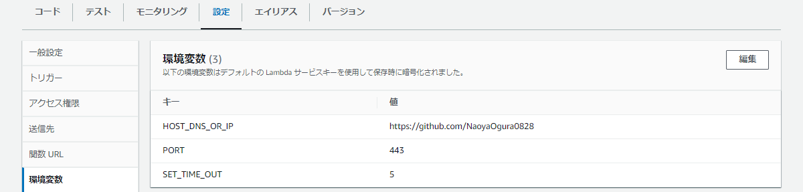

```conf
HOST_DNS_OR_IP = ${HostのDNSまたはIP}
PORT = ${接続ポート}
SET_TIME_OUT = ${タイムアウトするまでの秒数}
```

<br>

## crud-from-apigateway-to-dynamodb-by-http
以下のAWSアーキテクチャで動作する。

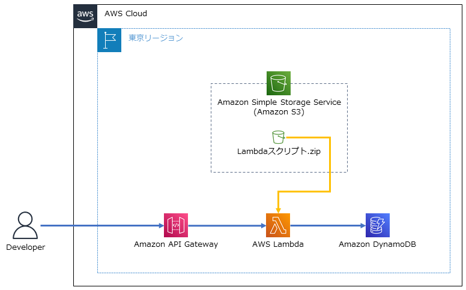

<br>

### 構築方法
- DynamoDBのパーティションキーを`id`に設定のうえ作成する。

<br>

- Lambda関数を作成する。
- 環境変数に以下の項目を設定する。

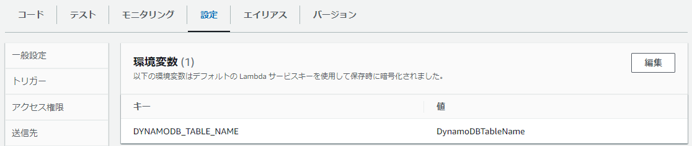

```conf
DYNAMODB_TABLE_NAME = ${DynamoDBのテーブル名}
```

<br>

- API Gatewayを`HTTP API`のAPIタイプで作成する。
- `ルート`と`メソッド`を以下のとおり作成する。

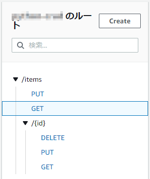

```conf
/items
    PUT
    GET
    /{id}
        DELETE
        PUT
        GET
```

- ルートの統合タイプは`Lambda 関数`を選択する。
- 統合ターゲットの`Lambda 関数`に本Lambda関数を指定する。

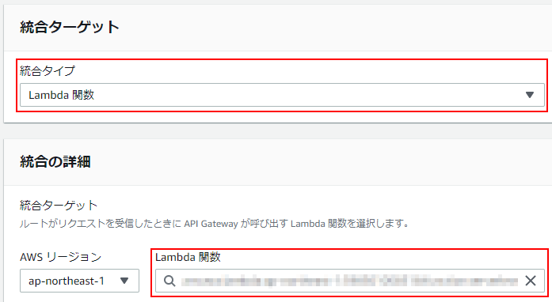

<br>

### 使用方法
Bashにて以下のコマンドを入力し実行する。

```bash
# 登録
# 登録Key名は任意で指定可能(idはパーティションキーの為必須)
$ curl -X "PUT" -H "Content-Type: application/json" -d "{\"id\": \"${任意のid}\", \"name\": \"${氏名}\", \"age\": \"${年齢}\", \"corp\": \"${社名}\"}" ${API Gateway URL}/items

# 更新
# 登録Key名は任意で指定可能
$ curl -X "PUT" -H "Content-Type: application/json" -d "{\"phone\": \"${電話番号}\", \"email\": \"${メールアドレス}\"}" ${API Gateway URL}/items/${更新対象id}

# 削除
$ curl -X "DELETE" ${API Gateway URL}/items/${削除対象id}

# 全取得
$ curl ${API Gateway URL}/items

# 一致検索
$ curl ${API Gateway URL}/items/${検索対象id}
```

<br>

## crud-from-apigateway-to-dynamodb-by-rest
以下のAWSアーキテクチャで動作する。


<br>

### 構築方法
- DynamoDBのパーティションキーを`id`に設定のうえ作成する。

<br>

- Lambda関数を作成する。
- 環境変数に以下の項目を設定する。


```conf
DYNAMODB_TABLE_NAME = ${DynamoDBのテーブル名}
```

<br>

- API Gatewayを`REST API`のAPIタイプで作成する。
- `リソース`と`メソッド`を以下のとおり作成する。

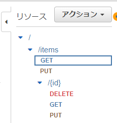

```conf
/
    /items
    GET
    PUT
        /{id}
        DELETE
        GET
        PUT
```

- メソッドの統合タイプは`Lambda 関数`を選択する。
- 統合リクエストの設定`Lambda プロキシ統合の使用`にチェックを入れる。
- `Lambda 関数`に本Lambda関数を指定する。

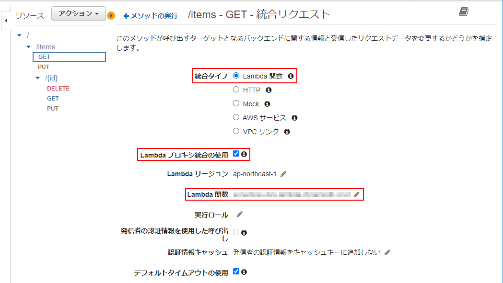

<br>

### 使用方法
Bashにて以下のコマンドを入力し実行する。

```bash
# 登録
# 登録Key名は任意で指定可能(idはパーティションキーの為必須)
$ curl -X "PUT" -H "Content-Type: application/json" -d "{\"id\": \"${任意のid}\", \"name\": \"${氏名}\", \"age\": \"${年齢}\", \"corp\": \"${社名}\"}" ${API Gateway URL}/${ステージ名}/items

# 更新
# 登録Key名は任意で指定可能
$ curl -X "PUT" -H "Content-Type: application/json" -d "{\"phone\": \"${電話番号}\", \"email\": \"${メールアドレス}\"}" ${API Gateway URL}/${ステージ名}/items/${更新対象id}

# 削除
$ curl -X "DELETE" ${API Gateway URL}/${ステージ名}/items/${削除対象id}

# 全取得
$ curl ${API Gateway URL}/${ステージ名}/items

# 一致検索
$ curl ${API Gateway URL}/${ステージ名}/items/${検索対象id}
```

<br>

## ses-send-email-with-s3-attachment
- Lambda関数を作成する。
- SESに`検証済み ID`を設定する。`設定セット`を利用する場合は、`設定セット`を設定する。
- `${添付ファイル名}`と一致するファイルを`${バケット名}`と一致するS3バケットに配置する。
- 環境変数に以下の項目を設定する。

> **Note**<br>
> `設定セット`を利用しない場合は、環境変数の`CONFIGURATION_SET_NAME`の値を空にする。


```conf
ATTACHMENT_FILE_NAME = ${添付ファイル名}
CHARACTER_ENCODING = ${文字コード}
CONFIGURATION_SET_NAME = ${設定セット名}
RECEIVER_EMAIL_ADDRESS = ${受信用メールアドレス}
S3_BUCKET_NAME = ${S3バケット名}
SENDER_EMAIL_ADDRESS = ${送信用メールアドレス}
```

<br>

## sync-files-from-s3-to-ec2-on-linux
- Lambda関数を作成する。
- 環境変数に以下の項目を設定する。

> **Note**<br>
> - 所有者, グループを変更しない場合は、環境変数の`LINUX_USER_AND_GROUP_NAME`の値を空にする。
> - S3バケット`/`ディレクトリを同期元とする場合は、`SOURCE_FILE_PATH`の値を空にする。

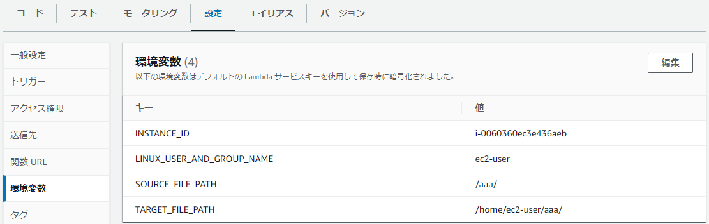

```conf
INSTANCE_ID = ${同期先EC2インスタンスID}
LINUX_USER_AND_GROUP_NAME = ${同期先EC2ユーザー名}
SOURCE_FILE_PATH = ${同期元S3バケットディレクトリ}
TARGET_FILE_PATH = ${同期先フルファイルパス}
```

<br>

- 同期元S3バケットの`イベント通知`を以下のとおり設定・作成する。

> **Note**<br>
> イベント名は任意の名称。

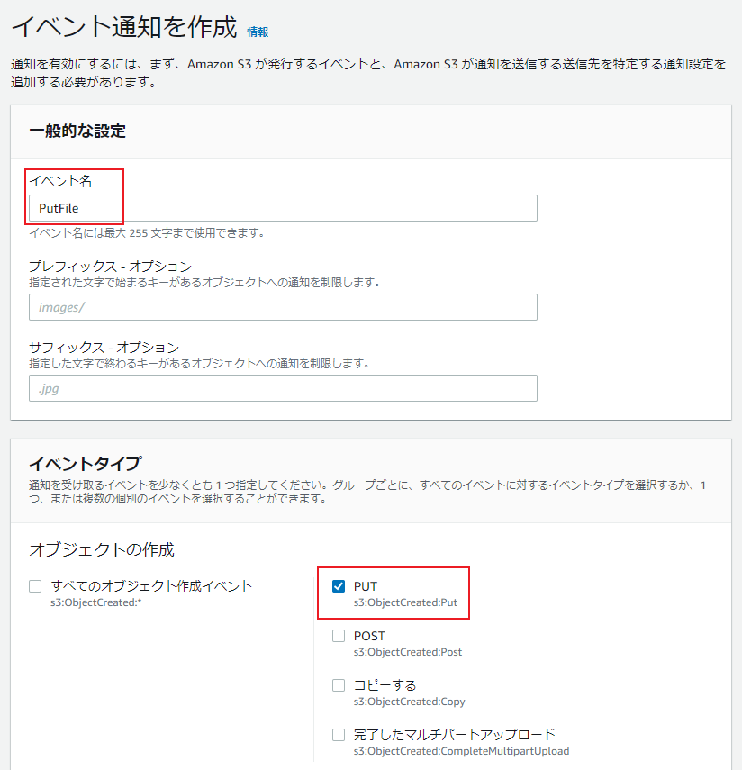

<br>

> **Note**<br>
> 作成したLambda関数を選択する。

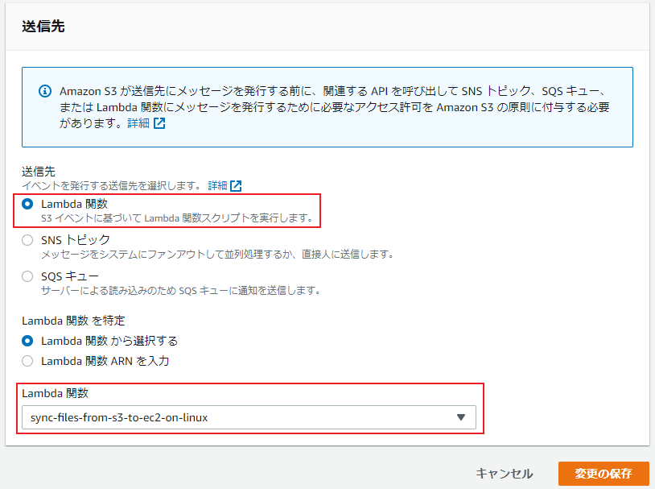

<br>

## sync-files-from-s3-to-ec2-on-windows
- Lambda関数を作成する。
- 環境変数に以下の項目を設定する。

> **Note**<br>
> S3バケット`/`ディレクトリを同期元とする場合は、`SOURCE_FILE_PATH`の値を空にする。

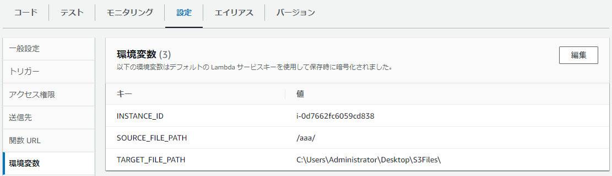

```conf
INSTANCE_ID = ${同期先EC2インスタンスID}
SOURCE_FILE_PATH = ${同期元S3バケットディレクトリ}
TARGET_FILE_PATH = ${同期先フルファイルパス}
```

<br>

- 同期元S3バケットの`イベント通知`を以下のとおり設定・作成する。

> **Note**<br>
> イベント名は任意の名称。


<br>

> **Note**<br>
> 作成したLambda関数を選択する。

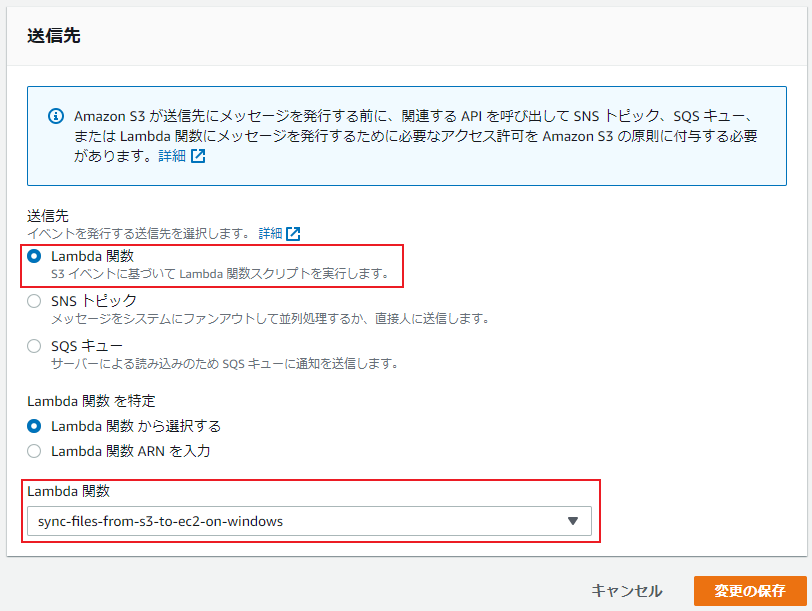

<br>