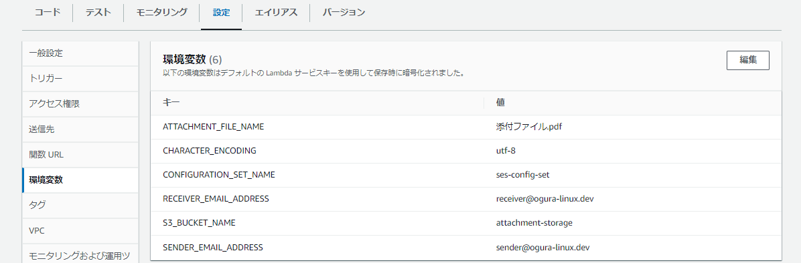

# aws-lambda-python-collection
AWS Lambdaで動作するPythonコード集

<br>

# Tree
本リポジトリは以下のファイル構成である。

```bash
aws-lambda-python-collection
├── README.md
├── check-requests-from-lambda # LambdaからHTTPまたはHTTPSリクエストをする
│   ├── LambdaLayer.zip # LambdaLayer用zip
│   ├── check-requests-from-lambda.py
│   └── create_lambda_layer_for_python_requests.sh # LambdaLayer.zip作成スクリプト
├── check-socket-from-lambda # Lambdaからの疎通を確認する
│   └── check-socket-from-lambda.py
├── images
│   ├── check-requests-from-lambda.png # 環境変数イメージ
│   └── check-socket-from-lambda.png # 環境変数イメージ
└── ses-send-email-with-s3-attachment # SESでS3に配置されたファイルを添付送信する
    └── ses-send-email-with-s3-attachment.py
```

<br>

# Requirement
AWS Lambdaでの動作を前提とする。<br>
Lambdaには、動作に必要な権限が付与されたIAMロールがアタッチされている事。

<br>

# Usage
## check-requests-from-lambda
- `create_lambda_layer_for_python_requests.sh`を実行する。<br>
このスクリプトは`LambdaLayer.zip`を生成する。<br>
RockyLinux9.1環境で動作確認済
- AWS Lambdaのレイヤーを作成する。<br>
生成した`LambdaLayer.zip`をアップロードする。
- Lambda関数を作成する。
- 環境変数に以下の項目を設定する。


```conf
HOST_DNS_OR_IP = ${HostのDNSまたはIP}
SET_TIME_OUT = ${タイムアウトするまでの秒数}
```

<br>

## check-socket-from-lambda
- Lambda関数を作成する。
- 環境変数に以下の項目を設定する。


```conf
HOST_DNS_OR_IP = ${HostのDNSまたはIP}
PORT = ${接続ポート}
SET_TIME_OUT = ${タイムアウトするまでの秒数}
```

<br>

## ses-send-email-with-s3-attachment
- Lambda関数を作成する。
- SESに`検証済み ID`を設定する。`設定セット`を利用する場合は、`設定セット`を設定する。
- `${添付ファイル名}`と一致するファイルを`${バケット名}`と一致するS3バケットに配置する。
- 環境変数に以下の項目を設定する。

> **Note**
> `設定セット`を利用しない場合は、環境変数の`CONFIGURATION_SET_NAME`の値を空にする。



```conf
ATTACHMENT_FILE_NAME = ${添付ファイル名}
CHARACTER_ENCODING = ${文字コード}
CONFIGURATION_SET_NAME = ${設定セット名}
RECEIVER_EMAIL_ADDRESS = ${受信用メールアドレス}
S3_BUCKET_NAME = ${S3バケット名}
SENDER_EMAIL_ADDRESS = ${送信用メールアドレス}
```

<br>
